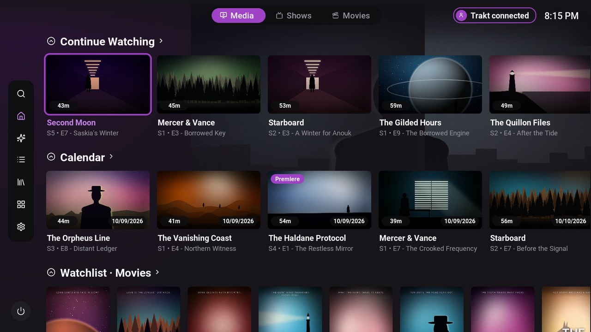
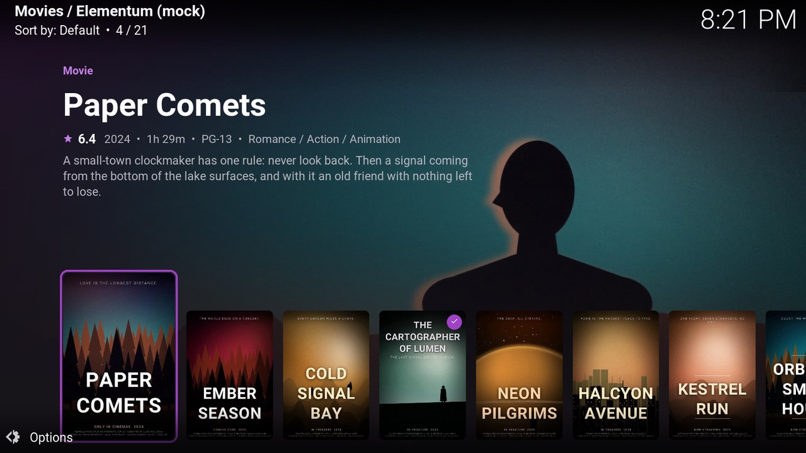
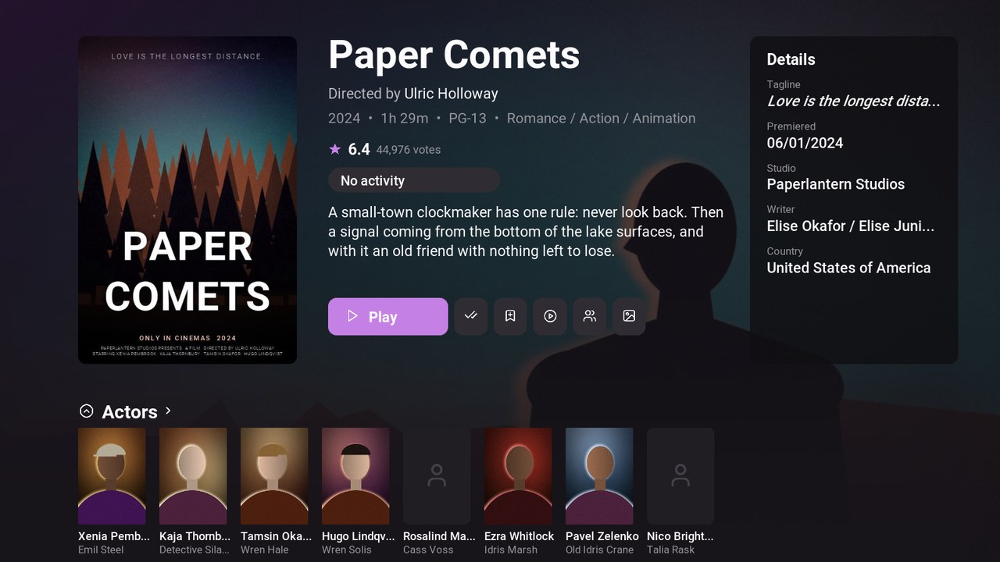
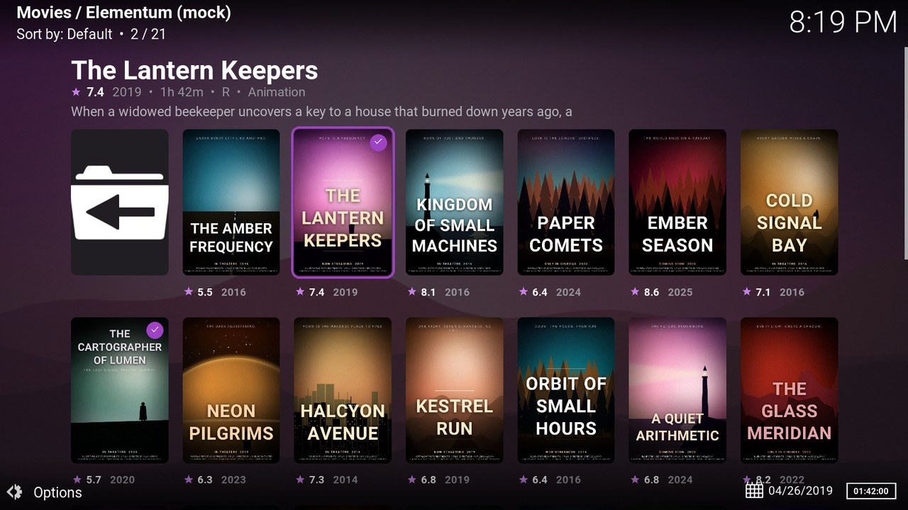
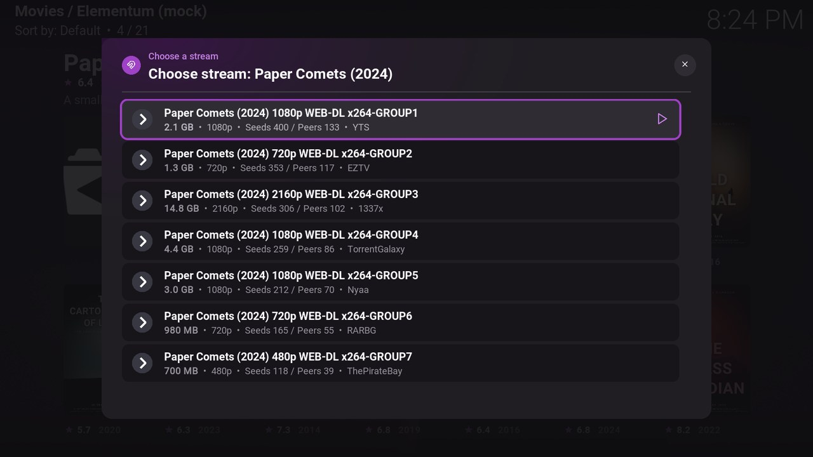

# Trakt Style — a Kodi skin for Elementum

A dark, Trakt-inspired skin for **Kodi 21 (Omega)**, built around the **Elementum** add-on.
It is a heavily modified [Estuary](https://github.com/xbmc/skin.estuary/) that looks and feels like the Trakt web app: deep ink background, purple accent, Roboto type, rounded poster and episode cards, and a home screen whose rows come straight from Elementum's Trakt lists.

The skin was designed and written together with [Claude](https://claude.ai) (Anthropic's AI assistant) for a personal Kodi + Elementum + Trakt setup.



| | |
|---|---|
|  |  |
|  |  |

<sub>Screenshots use mock titles and artwork.</sub>

## Features

- **Home screen with Media / Shows / Movies tabs** and a left icon rail for search, home, lists, library, add-ons and settings.
- **Trakt rows from Elementum** — Continue Watching, Calendar, Watchlist, Trending, Popular, Anticipated, Box Office, Recommendations, Premieres and your Trakt lists. Personal rows appear automatically once Elementum is signed in to Trakt.
- **Trakt-like movie and show pages** — poster, metadata, rating, details panel, cast row, and buttons for play, mark watched/unwatched, add to watchlist, trailer.
- **Elementum views** — poster grid, episode grid and a backdrop carousel. Elementum screens always use these views, even if a previous skin or Elementum's "Default view" setting saved a different one.
- **Themed Elementum menus** — custom icons for every Elementum menu entry (Movies, TV Shows, Search, Torrents, History, Providers, Trakt/TMDB lists…), tinted with the theme colour; big tiles on the main menu, compact two-line cards elsewhere.
- **Stream picker** styled to match (size, resolution, seeds/peers, provider).
- **Video player OSD** — now-playing block (poster, S/E, title), quality pills, end time, thick rounded progress bar with chapter marks, round controls; Elementum's buffering/status box sits above the player panel.
- **Start-up options** — open Kodi straight into Elementum (Back still returns to the home screen).
- **Colour themes** — default Trakt purple, Classic Red, Ink Blue.
- Skin settings for Trakt rows, local library rows, home backdrop, start-up window and home content.
- **Mouse / touchpad friendly home screen** — the wheel moves between rows instead of scrolling a row sideways; hovering a row shows ‹ › arrows at the right end of its header that page the row (with a keyboard or remote, rows scroll sideways with Left/Right as usual). This uses a small keymap the skin writes to `userdata/keymaps/skin.traktstyle-home-wheel.xml`; turn it off in *Skin settings → Home screen*, or delete that file if you switch to another skin.

## Requirements

- Kodi 21 "Omega" (`xbmc.gui` 5.17.0)
- [Elementum](https://elementum.surge.sh/) — recommended, signed in to Trakt for the personal rows. Without it the skin still works as a regular Estuary-based skin, but most of the home screen will be empty.

## Installation

> **Android TV / Fire TV shortcut:** Downloader app code **`8136490`** → see [Option B](#option-b--android-tv--fire-tv-with-the-downloader-app-just-type-a-code).

Kodi only installs zips from outside its official repo when **Settings → System → Add-ons → Unknown sources** is enabled. Turn that on first.

### Option A — via the Kodi repository (recommended, gets updates)

1. **Settings → File manager → Add source**, enter
   `https://sedvis.github.io/kodi-trakt-style-theme/`
   and name it `traktstyle`.
2. **Settings → Add-ons → Install from zip file → traktstyle → `repository.traktstyle.zip`**.
3. **Install from repository → Trakt Style Repository → Look and feel → Skin → Trakt Style → Install**, and say *Yes* when Kodi asks to switch skins.

New versions then arrive through Kodi's normal add-on updates.

### Option B — Android TV / Fire TV with the Downloader app (just type a code)

1. Install **Downloader** (by AFTVnews) from the Play Store / Amazon Appstore.
2. In Downloader, enter the code **`8136490`**.
   It points to `https://sedvis.github.io/kodi-trakt-style-theme/repository.traktstyle.zip` (also reachable in any browser as `aftv.news/8136490`), which always serves the latest repository add-on.
   The file is saved to the device's `Download` folder.
3. In Kodi: **Settings → Add-ons → Install from zip file → External storage → Download → `repository.traktstyle.zip`** (allow Kodi storage access if Android asks), then continue with step 3 of Option A.

### Option C — plain zip

Download `skin.traktstyle-<version>.zip` from the [Releases](https://github.com/sedvis/kodi-trakt-style-theme/releases) page and use **Install from zip file**. No automatic updates this way.

> Do not use GitHub's auto-generated "Source code" zip — its folder name is not a valid Kodi add-on id.

## Setting it up for Elementum

- Install Elementum and sign in to Trakt from its settings (**Elementum → Settings → Trakt → Authorize**).
- **Settings → Interface → Skin → Configure skin…** — choose what the home screen shows, whether Kodi opens straight into Elementum, the colour theme and whether to show local library rows.

## Building

```bash
python build.py
```

Source generators live in `tools/`: `build_home.py` writes `xml/Home.xml` (edit its `ROWS` list, not the XML), `make_assets.py` renders the textures and icons (needs Pillow, the Lucide icon font and Roboto Bold), `restyle_stock.py` restyles the stock Estuary media.

Creates in `dist/`:

- `skin.traktstyle-<version>.zip` — installable skin package
- `repository.traktstyle-<version>.zip` — repository add-on package
- `site/` — the Kodi repository (`addons.xml`, `addons.xml.md5`, zips), published to the `gh-pages` branch / GitHub Pages

Release flow: bump `version` in `addon.xml`, add a `changelog.txt` entry, run `build.py`, commit, tag `vX.Y.Z`, attach the two zips to a GitHub release and push `dist/site/` to `gh-pages`.

## Credits and license

- Based on **Estuary** by phil65 and Ichabod Fletchman (Team Kodi).
  Code: [GPL-2.0](https://www.gnu.org/licenses/gpl-2.0). Artwork: [CC BY-SA 4.0](https://creativecommons.org/licenses/by-sa/4.0/). See [LICENSE.txt](LICENSE.txt).
- Fonts: Roboto (Apache 2.0) and Noto Mono — licenses in `fonts/`.
- Home images: CC0 (see `extras/home-images/LICENSE`).

Unofficial fan skin — not affiliated with or endorsed by Trakt or Elementum. Trakt is a trademark of trakt, inc.
